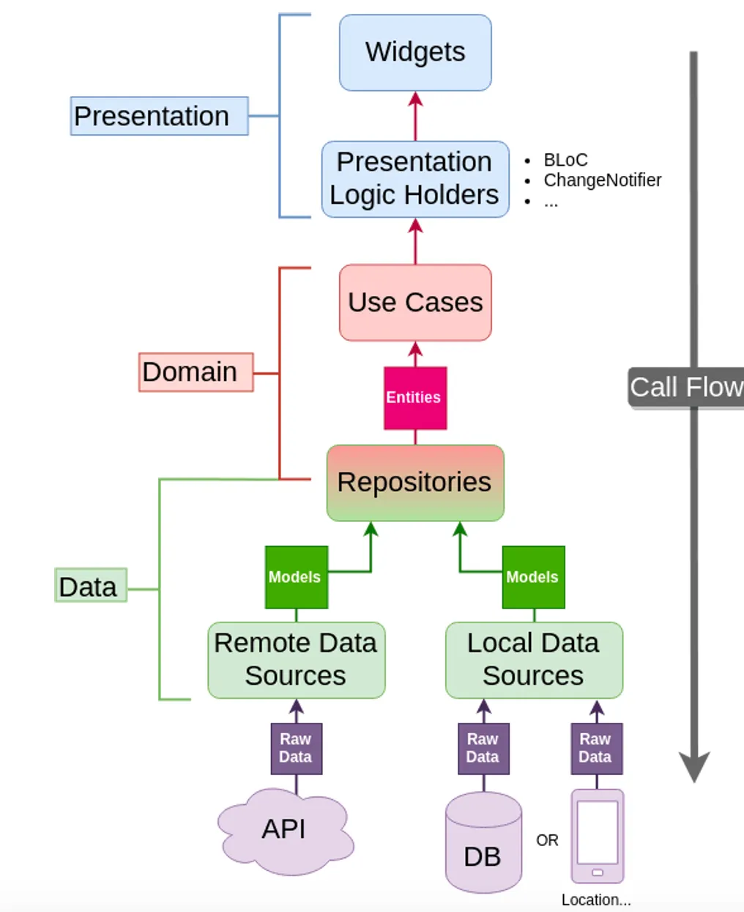
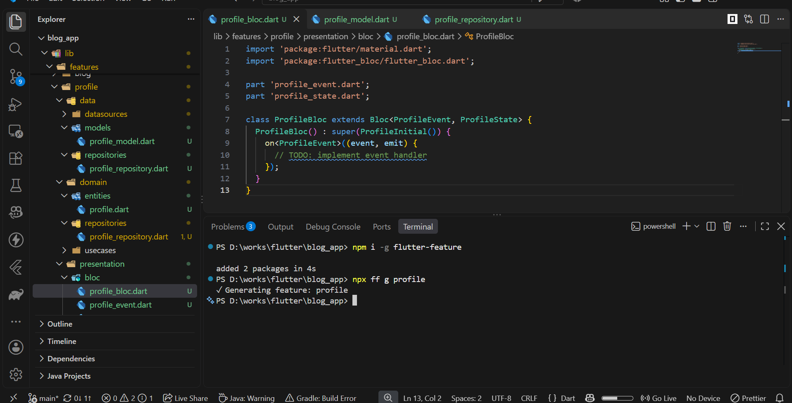
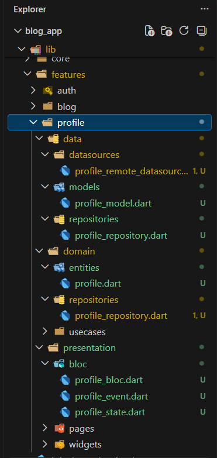

# flutter-feature

A CLI tool to generate the repetitive boilerplate of a Flutter feature.

> Build the structure once. Generate it whenever you need it.



## Installation

```bash
npm install -g flutter-feature
```

Or with pnpm:

```bash
pnpm add -g flutter-feature
```

After installation, use either `flutter-feature` or the shorter `ff`.

## Usage

Run the command from the root of a Flutter project:

```bash
ff generate profile
```

or:

```bash
ff g profile
```

This creates the feature under:

```text
lib/features/profile/
```



## What gets generated?

The current generator creates:

```text
lib/
└── features/
    └── profile/
        ├── data/
        │   ├── datasources/
        │   │   └── profile_remote_datasource.dart
        │   ├── models/
        │   │   └── profile_model.dart
        │   └── repositories/
        │       └── profile_repository.dart
        ├── domain/
        │   ├── entities/
        │   │   └── profile.dart
        │   └── repositories/
        │       └── profile_repository.dart
        └── presentation/
            └── bloc/
                ├── profile_bloc.dart
                ├── profile_event.dart
                └── profile_state.dart
```



The directory structure and generated files are intentionally separate. Some directories can exist even when they do not currently have a generated template.

## Project-aware templates

Templates can use information from the Flutter project's `pubspec.yaml`.

For example:

```yaml
name: blog_app
description: "A new Flutter project with supabase."
```

provides:

```text
appName = blog_app
```

A model template can then generate:

```dart
import 'package:blog_app/features/profile/domain/entities/profile.dart';

class ProfileModel extends Profile {
  const ProfileModel();
}
```

## Template system

Templates live under:

```text
src/templates/feature/
```

They use variables such as:

```text
{{appName}}
{{snakeName}}
{{PascalName}}
```

For example:

```dart
import 'package:{{appName}}/features/{{snakeName}}/domain/entities/{{snakeName}}.dart';

class {{PascalName}}Model extends {{PascalName}} {
  const {{PascalName}}Model();
}
```

## Template mapping

`template-path.ts` defines what the feature generator creates by mapping:

```text
layer
folder
template
output
```

For example:

```ts
t({
  layer: "domain",
  folder: "entities",
  template: "entity.dart.template",
  output: "{{snakeName}}.dart",
})
```

maps:

```text
domain/entities/entity.dart.template
                ↓
domain/entities/profile.dart
```

To add another permanent piece of boilerplate:

1. Create the `.dart.template` file.
2. Add its mapping to `template-path.ts`.
3. Build the package.

The generation engine handles the rest.

## Development

Install dependencies:

```bash
pnpm install
```

Build:

```bash
pnpm build
```

Run during development:

```bash
pnpm dev -- g profile
```

Build flow:

```text
TypeScript source
      ↓
     tsc
      ↓
  tsc-alias
      ↓
   dist/*.js
      ↓
copy templates
      ↓
dist/templates/
```

`tsc-alias` resolves the `@/` imports after TypeScript compilation, while the template-copy step places the runtime templates into `dist/templates/`.

## Requirements

- Node.js
- A Flutter project
- `pubspec.yaml` at the Flutter project root

## License

MIT

---
